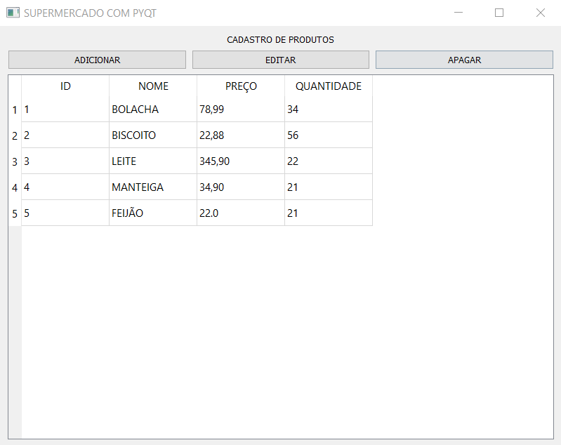
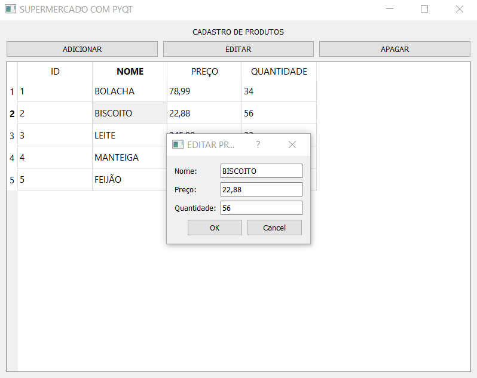
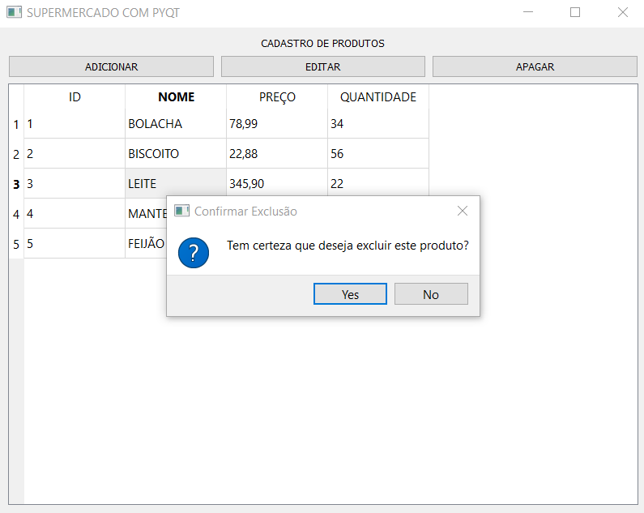
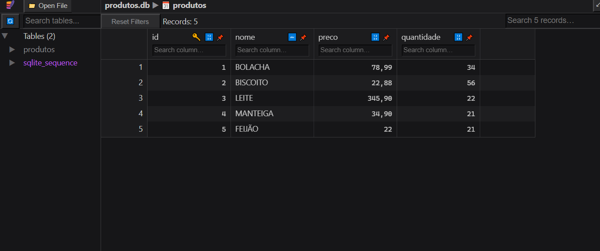

# SUPERMERCADO COM PYQT
👨‍🏫CRUD DE CADASTRO DE NOME, PREÇO E QUANTIDADE DE PRODUTOS COM PYQT E SQLITE.

 <br>
 <br>
 <br>
 <br>

## DESCRIÇÃO:
Este aplicativo desenvolvido em PyQt5 e SQLite é um sistema básico de CRUD (Create, Read, Update, Delete) para gerenciar produtos de um supermercado. Ele oferece as seguintes funcionalidades principais:

1. **Cadastro de Produtos**:
   - Permite adicionar novos produtos especificando nome, preço e quantidade através de uma interface gráfica intuitiva.

2. **Edição de Produtos**:
   - Possibilita a edição dos dados de um produto existente, incluindo nome, preço e quantidade, diretamente na tabela de produtos.

3. **Remoção de Produtos**:
   - Permite a exclusão de um produto selecionado da lista, após confirmação por meio de uma caixa de diálogo.

4. **Visualização de Produtos**:
   - Exibe todos os produtos cadastrados em uma tabela, apresentando as colunas de ID, Nome, Preço e Quantidade.

5. **Persistência dos Dados**:
   - Utiliza um banco de dados SQLite (`produtos.db`) para armazenar os dados dos produtos de forma permanente.

6. **Interface Amigável**:
   - A interface gráfica é construída com PyQt5, oferecendo botões claros para cada funcionalidade e uma tabela interativa para exibição e manipulação dos dados.

## EXECUTANDO O PROJETO: 
1. **Instalação:**
   - Entre no diretório `CODIGO` e execute o comando:

   ```bash
   pip install -r requirements.txt
   ```

2. **Iniciando o APP:**
   - Entre no diretório `CODIGO` e execute com o comando:
   ```bash
   python CODIGO.py
   ```

3. **Interagindo com o Aplicativo**:
   - **Visualização de Produtos**: Todos os produtos cadastrados são exibidos em uma tabela com colunas para ID, Nome, Preço e Quantidade. Essa visualização facilita o acompanhamento e a gestão do inventário de produtos.
   - **Adicionar**: Clique no botão "Adicionar", preencha os campos na janela de diálogo e clique em "Ok" para inserir um novo produto na lista.
   - **Editar**: Selecione um produto na tabela e clique no botão "Editar". Faça as alterações desejadas na janela de diálogo que aparecerá e clique em "Ok" para atualizar os dados do produto.
   - **Deletar**: Selecione um produto na tabela e clique no botão "Apagar". Confirme a exclusão na caixa de diálogo para remover o produto do banco de dados.

## NÃO SABE?
- Entendemos que para manipular arquivos em muitas linguagens e tecnologias, é necessário possuir conhecimento nessas áreas. Para auxiliar nesse aprendizado, oferecemos cursos gratuitos disponíveis:
* [CURSO DE PYTHON](https://github.com/VILHALVA/CURSO-DE-PYTHON)
* [CURSO DE PYQT](https://github.com/VILHALVA/CURSO-DE-PYQT)
* [CURSO DE SQLITE](https://github.com/VILHALVA/CURSO-DE-SQLITE)
* [CONFIRA MAIS CURSOS](https://github.com/VILHALVA?tab=repositories&q=+topic:CURSO)

## CREDITOS:
- [PROJETO CRIADO PELO VILHALVA](https://github.com/VILHALVA)


